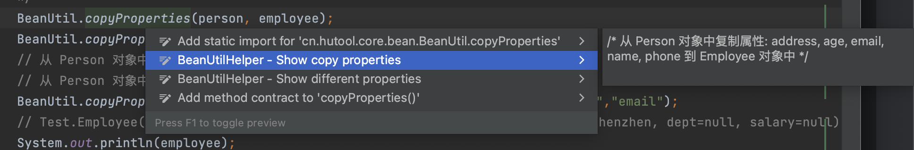
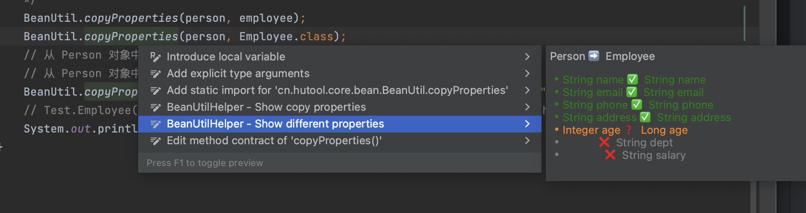

<h3> BeanUtilHelper </h3>
<ul>
    <li>One-click generation of property copy comments, explicitly declaring the copied properties, one-click preview of copied properties</li>
    <li>One-click generation of different property comments, one-click preview of different properties</li>
    <li>Automatically identify the <code>BeanUtil.copyProperties</code>and <code>BeanUtils.copyProperties</code>
        methods.
    </li>
    <li>Automatically retrieve the common properties of the source and target types and generate line comments.</li>
    <li>Automatically convert multiple property copy comments into block comments.</li>
</ul>
<h3>Usage</h3>
<ol>
    <li>Place the cursor on the <code>BeanUtil.copyProperties</code> or <code>BeanUtils.copyProperties</code> method.
    </li>
    <li>Trigger Intent action (⌥ + Enter for Mac; Alt + Enter for Win/Linux) and select "BeanUtilHelper - Show copy
        properties" or "BeanUtilHelper - Show different properties" to preview.
    </li>
    <li>
        Press enter to generate comments;
    </li>
</ol>

<h3> BeanUtil助手 </h3>
<ul>
    <li>一键生成复制属性的注释,显式声明复制出的属性,一键预览复制的属性</li>
    <li>一键生成差异属性的注释,一键预览差异的属性,标识差异化属性,发现潜在问题</li>
    <li>自动识别 <code>BeanUtil.copyProperties</code> 与 <code>BeanUtils.copyProperties</code>方法</li>
    <li>自动获取源类型与目标类型共有属性生成行注释</li>
    <li>自动转换多属性复制注释为块注释</li>
</ul>
<h3>使用方式</h3>
<ol>
    <li>将光标放置在 <code>BeanUtil.copyProperties</code> 或 <code>BeanUtils.copyProperties</code> 方法上</li>
    <li>唤起意图动作 ( ⌥ + Enter for Mac; Alt + Enter for Win/Linux ),选择 "BeanUtilHelper - Show copy properties" 或 "BeanUtilHelper - Show different properties" 预览</li>
    <li>回车生成注释</li>
</ol>

插件演示

复制预览

差异预览

